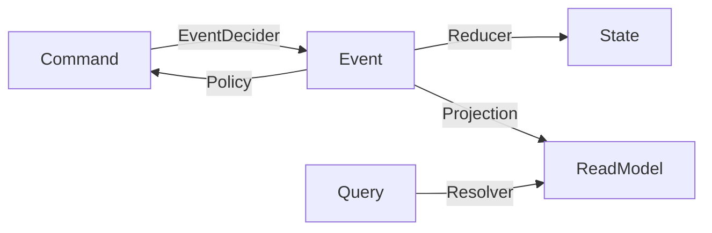

# Introduction

**revion.js** is a TypeScript framework that enables type-safe and declarative expression of CQRS + Event Sourcing architecture.
It separates domain logic from infrastructure and realizes safe application design based on types.

The framework's design philosophy consists of the following four points:

- 🎯 **Simplicity First** — Minimize boilerplate and focus on the domain
- 🏗️ **Type-Safe Functional Programming** — Declarative, type-safe, and easy to combine functions
- 🧪 **Effortless Testing** — Easy implementation of tests in BDD format
- ⚡️ **Lightweight and Fast** — Accelerate development with minimal setup

## Core Interfaces

revion.js provides the main components of CQRS as functional interfaces.
By simply defining these, you can build an event-driven domain.

| Layer             | Interface      | Signature                        | Responsibility                                          |
| ----------------- | -------------- | -------------------------------- | ------------------------------------------------------- |
| **Command**       | `EventDecider` | `(State, Command) → Event`       | Determines events generated from commands               |
|                   | `Reducer`      | `(State, Event) → State`         | Updates state by applying events                        |
| **Event Handler** | `Policy`       | `(Event) → Command`              | Generates new commands triggered by events              |
|                   | `Projection`   | `(Event, ReadModel) → ReadModel` | Updates views and aggregates based on events            |
| **Query**         | `Resolver`     | `(Query) → ReadModel`            | Processes queries and returns DTOs                      |

`Reducer`, `EventDecider`, `Policy`, and `Projection` have corresponding **`map`** functions that allow declarative control of state transitions and event/command validity.

### Flow Diagram



## Example: Minimal Counter Domain

```ts
// Command → Event
const eventDecider: EventDecider<CounterCommand, CounterState, CounterEvent> = {
  init: ({ command }) => ({
    type: "initialized",
    id: command.id,
    payload: command.payload,
  }),
  increment: ({ command }) => ({ type: "incremented", id: command.id }),
  decrement: ({ command }) => ({ type: "decremented", id: command.id }),
};

// Event → State
const reducer: Reducer<CounterState, CounterEvent> = {
  initialized: ({ state, event }) => ({
    ...state,
    type: "active",
    count: event.payload.count,
  }),
  incremented: ({ state }) => {
    state.count += 1;
  },
  decremented: ({ state }) => {
    state.count -= 1;
  },
};
```

## Why revion.js

1. **Maximize Development Efficiency**

   - Build the entire CQRS flow simply by defining standard interfaces
   - Focus on the domain and reduce boilerplate

2. **Improve Code Quality**

   - Prevent inconsistencies and errors at compile time through type safety and declarative state transitions

3. **Testability**

   - Validate domain logic early in BDD format using `aggregateFixture()` and `FakeHandler`
