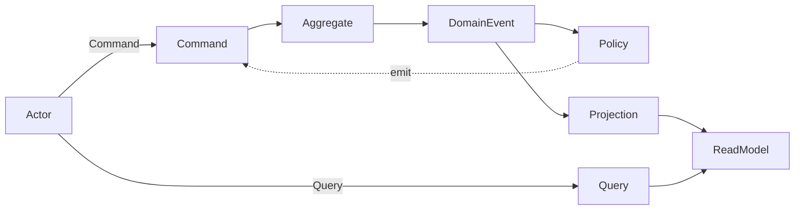

# Concept

CQRS + Event Sourcing allows you to organize complex business rules and build systems resilient to change, but it requires boilerplate code for aggregate restoration from event stores, command execution, and event persistence for each API, making implementation complex.
Particularly for small-scale applications, this implementation redundancy becomes a barrier to adoption.

revion.js is a TypeScript framework that automates the typical processing flow of CQRS + Event Sourcing.
By providing an interface that allows declarative expression of CQRS components, you can intuitively and type-safely build business rules and processes.

## Comparison with Traditional Code

### Implementation Without a Framework

In typical CQRS + Event Sourcing implementations, you need to write code for aggregate restoration, command application, event emission, and store persistence.

In this structure, event store operations and restoration logic are scattered across each command, resulting in a lot of procedural processing.

```typescript
async function handleIncrement(command: IncrementCounterCommand) {
  const events = await eventStore.loadEvents(command.counterId);
  const counter = Counter.rehydrate(events);

  counter.increment();

  await eventStore.append(counter.uncommitted);
}
```

### Implementation with revion.js

With revion.js, you can achieve the same functionality by simply declaring command definitions and state transition rules.

Event store read/write operations, event propagation, and state reconstruction are all automatically handled internally by the framework, allowing developers to focus on defining business logic.

```typescript
const decider: EventDecider<CounterState, CounterCommand, CounterEvent> = {
  increment: ({ command }) => ({ type: 'incremented', id: command.id }),
  decrement: ({ command }) => ({ type: 'decremented', id: command.id }),
}

const reducer: Reducer<CounterState, CounterEvent> = {
  incremented: ({ state }) => { state.count += 1 },
  decremented: ({ state }) => { state.count -= 1 }
}
```

## CQRS Architecture Flow

To understand revion.js, let's first review the basic flow of CQRS + Event Sourcing, which serves as its foundation.
CQRS + Event Sourcing clearly separates Commands and Queries, building systems centered around events.

### Write Operations

```txt
Command → Aggregate → DomainEvent → EventStore → ReadModel
```

1. Receive a command (e.g., create an order)
2. Reconstruct the current state (Aggregate) from past events
3. Apply the command to generate new events
4. Save events to the EventStore
5. Update the ReadModel through projection

### Read Operations

```txt
Query → ReadModel
```

1. Receive a query (e.g., get order list)
2. Read and return the projected ReadModel

## Correspondence with Event Storming

In the previous section, we reviewed the basic flow of CQRS and the components involved.
Event Storming is a technique for visualizing this flow at the business design stage.

Event Storming is a design method that visualizes business domains centered on events.
Using sticky notes, elements such as Commands, Aggregates, DomainEvents, Policies, and ReadModels are arranged chronologically to visualize business flows.


This flow of "Command → DomainEvent → State Update" naturally corresponds to the processing structure of CQRS + Event Sourcing.

## revion.js Architecture

revion.js is designed to allow you to directly translate the components and their relationships organized through Event Storming into code.

| Event Storming Element     | revion.js Expression | Description                    |
|---------------------|------------------|-----------------------|
| Command             | Command          | Instructions to execute              |
| Aggregate           | Aggregate        | Aggregate (including behavior)       |
| Command → Aggregate | EventDecider     | Conversion from command to event        |
| Aggregate → Event   | Reducer          | State update by event         |
| DomainEvent         | DomainEvent      | Emitted events             |
| Event → Policy      | Policy           | Issuing new commands in response to events |
| Event → ReadModel   | Projection       | ReadModel update by event    |
| Query → ReadModel   | QueryResolver    | Response to queries               |

### Overall Architecture

The revion.js architecture consists of three domains (Command / Event / Query).
Each domain is modularized by business logic units (aggregates or tables) and connected through dedicated Buses.



Roles and composition of each domain:

| Domain    | Bus        | Module Unit    | Main Components                      |
|---------|------------|--------------|---------------------------------|
| Command | CommandBus | Aggregate    | Command, State, DomainEvent, EventDecider, Reducer, EventStore  |
| Event   | EventBus   | EventReactor | DomainEvent, ReadModel, Command, Policy, Projection, CommandDispatcher, ReadModelStore             |
| Query   | QueryBus   | QuerySource  | ReadModel, Query, QueryResolver |

The infrastructure layer on which each Bus depends can be any implementation that conforms to the defined interface (In-Memory, PostgreSQL, MongoDB, etc.).

### Command Domain

In the Command domain, the flow of Command → Aggregate → DomainEvent is organized per aggregate.


The module unit is an Aggregate. Each aggregate defines the following components:

- Command: Instructions to execute (e.g., increment the counter)
- EventDecider: Logic that receives commands and determines which events to emit
- Reducer: Logic that receives events and defines how to update the aggregate's state
- DomainEvent: Emitted events (e.g., counter was incremented)

Counter example:

```typescript
// EventDecider: Conversion from command to event
const decider: EventDecider<CounterState, CounterCommand, CounterEvent> = {
  increment: ({ command }) => ({ type: 'incremented', id: command.id }),
  decrement: ({ command }) => ({ type: 'decremented', id: command.id }),
}

// Reducer: State update by event
const reducer: Reducer<CounterState, CounterEvent> = {
  incremented: ({ state }) => { state.count += 1 },
  decremented: ({ state }) => { state.count -= 1 },
}
```

When the CommandBus receives a command, it restores the Aggregate from past events, generates events with the EventDecider, updates the state with the Reducer, and then saves to the EventStore.

### Event Domain

In the Event domain, the flow of DomainEvent → Policy / Projection is organized by business logic units.


The module unit is EventReactor. EventReactor defines the following components:

- Policy: Rules that react to events and issue new commands (e.g., issue a reset command when counter reaches 10)
- Projection: Logic that reacts to events and updates the ReadModel (e.g., reflect counter value in view)

Counter example:

```typescript
const policy: Policy<CounterEvent, CounterCommand> = {
  incremented: ({ event }) => {
    return event.payload.count >= 10 ? { type: 'reset', id: event.id } : null
  },
  decremented: () => null
}

const projection: Projection<CounterEvent, CounterReadModel, typeof projectionMap> = {
  incremented: {
    counter: ({ readModel }) => { readModel.count += 1 }
  },
  decremented: {
    counter: ({ readModel }) => { readModel.count -= 1 }
  }
}
```

The EventBus subscribes to emitted events and executes the EventReactor's Policies and Projections. It also supports event replay and asynchronous reprocessing.

### Query Domain

In the Query domain, the flow of Query → ReadModel is organized by table or view units.


The module unit is QuerySource. QuerySource defines the following components:

- Query: Request for data retrieval (e.g., get current counter value)
- QueryResolver: Logic that returns responses from the ReadModel for queries
- ReadModel: Projected data model (e.g., counter view)

Counter example:

```typescript
const resolver: QueryResolver<CounterQuery, CounterQueryResult, CounterReadModel> = {
  getCounter: async ({ query, store }) => {
    const counter = await store.findById('counter', query.payload.id)
    return { type: 'counter', item: counter }
  }
}
```

The QueryBus receives data retrieval requests and returns the latest ReadModel. It operates independently of the domain and maximizes read performance.

## Summary

revion.js is a framework that automates the typical processing flow of CQRS + Event Sourcing and allows you to express the structure organized through Event Storming directly as code.

- Event-centered design separates responsibilities across three domains: Command, Event, and Query
- Declarative definitions allow type-safe description of business logic
- Flow automation handles aggregate restoration, event persistence, and propagation

Developers can focus on defining business logic and directly translate business flows depicted in Event Storming into code.

## Next Steps

Let's experience this concept with actual code.
In the next page, you'll learn the basics of revion.js using a TODO app as an example.

→ [Tutorial](/docs/tutorial)
