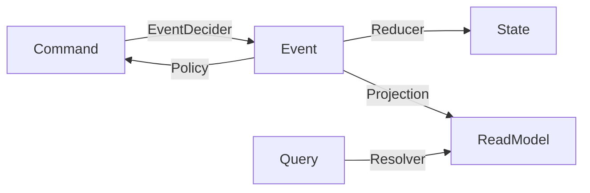

# Introduction

**revion.js** は、CQRS + Event Souring アーキテクチャを型安全かつ宣言的に表現できる TypeScript フレームワークです。
ドメインロジックとインフラを分離し、型に基づいた安全なアプリケーション設計を実現します。

フレームワークの設計思想は以下の 4 点です：

- 🎯 **Simplicity First** — ボイラープレートを最小限にして、ドメインに集中
- 🏗️ **Type-Safe Functional Programming** — 宣言的かつ型安全で、関数を組み合わせやすい
- 🧪 **Effortless Testing** — BDD 形式でのテストを容易に実装
- ⚡️ **Lightweight and Fast** — 最小限のセットアップで開発を迅速化

## Core Interfaces

revion.js は、CQRS の主要コンポーネントを関数インターフェースとして提供します。
これらを定義するだけで、イベント駆動のドメインを構築できます。

| Layer             | Interface      | Signature                        | Responsibility                           |
| ----------------- | -------------- | -------------------------------- | ---------------------------------------- |
| **Command**       | `EventDecider` | `(State, Command) → Event`       | コマンドから発生するイベントを決定       |
|                   | `Reducer`      | `(State, Event) → State`         | イベントを適用して状態を更新             |
| **Event Handler** | `Policy`       | `(Event) → Command`              | イベントをトリガーに新たなコマンドを生成 |
|                   | `Projection`   | `(Event, ReadModel) → ReadModel` | イベントをもとにビューや集約を更新       |
| **Query**         | `Resolver`     | `(Query) → ReadModel`            | クエリを処理して DTO を返す              |

`Reducer`、`EventDecider`、`Policy`、`Projection` には対応する **`map`** があり、状態遷移やイベント・コマンドの有効性を宣言的に制御できます。

### Flow Diagram



## Example: Minimal Counter Domain

```ts
// Command → Event
const eventDecider: EventDecider<CounterCommand, CounterState, CounterEvent> = {
  init: ({ command }) => ({
    type: "initialized",
    id: command.id,
    payload: command.payload,
  }),
  increment: ({ command }) => ({ type: "incremented", id: command.id }),
  decrement: ({ command }) => ({ type: "decremented", id: command.id }),
};

// Event → State
const reducer: Reducer<CounterState, CounterEvent> = {
  initialized: ({ state, event }) => ({
    ...state,
    type: "active",
    count: event.payload.count,
  }),
  incremented: ({ state }) => {
    state.count += 1;
  },
  decremented: ({ state }) => {
    state.count -= 1;
  },
};
```

## Why revion.js

1. **開発効率の最大化**

   - 標準インターフェースを定義するだけで CQRS 全体のフローを構築可能
   - ドメインに集中でき、ボイラープレートを削減

2. **コード品質の向上**

   - 型安全と宣言的状態遷移により、不整合や誤りをコンパイル時に防止

3. **テスト容易性**

   - `aggregateFixture()`や`FakeHandler`により、BDD 形式でドメインロジックを早期に検証可能
