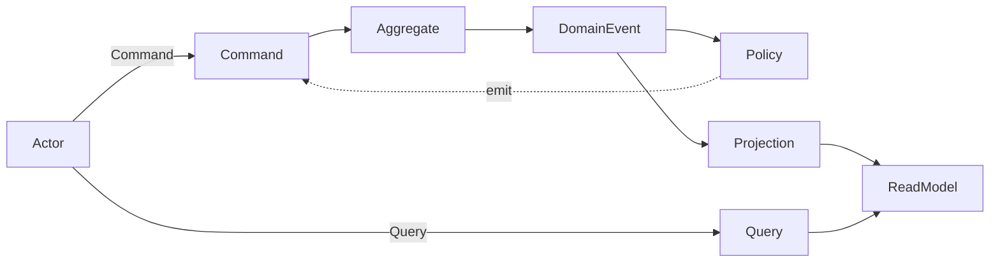

# Concept

CQRS + Event Sourcingは、複雑なビジネスルールを整理し変更に強いシステムを構築できますが、イベントストアからの集約復元、コマンド実行、イベント保存といったボイラープレートがAPIごとに必要となり、実装が複雑になる課題があります。  
特に小規模アプリケーションでは、この実装の冗長性が導入の障壁となります。

revion.jsは、CQRS + Event Sourcingの定型的な処理フローを自動化するTypeScriptフレームワークです。
CQRSのコンポーネントを宣言的に表現できるインターフェースを提供しているため、ビジネスルールや業務プロセスを直感的に型安全に構築できます。

## 従来コードとの比較

### フレームワークなしの実装

CQRS + Event Sourcingの典型的な実装では、Aggregateの復元、コマンド適用、イベント発行、ストア保存といった処理を記述する必要があります。  

この構造では、イベントストアの操作や復元ロジックが各コマンドに分散し、手続き的な処理が多くなってしまいます。

```typescript
async function handleIncrement(command: IncrementCounterCommand) {
  const events = await eventStore.loadEvents(command.counterId);
  const counter = Counter.rehydrate(events);

  counter.increment();

  await eventStore.append(counter.uncommitted);
}
```

### revion.jsの実装

revion.jsでは、コマンドの定義と状態遷移のルールを宣言的に記述するだけで同じ機能を実現できます。

イベントストアの読み書き、イベント伝搬、状態再構築などはすべてフレームワーク内部で自動的に処理されるため、開発者はビジネスロジックの定義に集中できます。

```typescript
const decider: EventDecider<CounterState, CounterCommand, CounterEvent> = {
  increment: ({ command }) => ({ type: 'incremented', id: command.id }),
  decrement: ({ command }) => ({ type: 'decremented', id: command.id }),
}

const reducer: Reducer<CounterState, CounterEvent> = {
  incremented: ({ state }) => { state.count += 1 },
  decremented: ({ state }) => { state.count -= 1 }
}
```

## CQRSのアーキテクチャフロー

revion.jsを理解するには、まず基盤となるCQRS + Event Sourcingの基本的なフローを押さえておきましょう。
CQRS + Event SourcingではCommandとQueryを明確に分離し、イベントを中心にシステムを構築します。

### 書き込み処理

```txt
Command → Aggregate → DomainEvent → EventStore → ReadModel
```

1. コマンドを受け取る (例: 注文を作成する)
2. 過去のイベントから現在の状態 (Aggregate) を再構築
3. コマンドを適用して新しいイベントを生成
4. イベントを EventStore に保存
5. 投影 (Projection) により ReadModel を更新

### 読み取り処理

```txt
Query → ReadModel
```

1. クエリを受け取る (例: 注文一覧を取得する)
2. 投影済みの ReadModel を読み取って返す

## イベントストーミングとの対応

前のセクションでCQRSの基本的な流れと、そこに登場するコンポーネントを確認しました。  
この流れを業務設計の段階で可視化する手法としてイベントストーミング (Event Storming)があります。

イベントストーミングは、ビジネスドメインをイベントを軸に可視化する設計手法です。  
付箋を使ってCommand、Aggregate、DomainEvent、Policy、ReadModelなどの要素を時系列に並べ、業務フローを可視化します。


この「Command → DomainEvent → 状態更新」という流れは、CQRS + Event Sourcingの処理構造と自然に対応します。

## revion.jsのアーキテクチャ

revion.js はイベントストーミングで整理されたコンポーネントとその関係性を、そのままコードに落とし込めるように設計されています。

| イベントストーミングの要素     | revion.js での表現 | 説明                    |
|---------------------|------------------|-----------------------|
| Command             | Command          | 実行する指示              |
| Aggregate           | Aggregate        | 集約 (振る舞いを含む)       |
| Command → Aggregate | EventDecider     | コマンドからイベントへの変換        |
| Aggregate → Event   | Reducer          | イベントによる状態更新         |
| DomainEvent         | DomainEvent      | 発行されるイベント             |
| Event → Policy      | Policy           | イベントに反応した新しいコマンド発行 |
| Event → ReadModel   | Projection       | イベントによるReadModel更新    |
| Query → ReadModel   | QueryResolver    | クエリへの応答               |

### アーキテクチャ全体像

revion.jsのアーキテクチャは、3つの領域 (Command / Event / Query) で構成されます。  
各領域はビジネスロジックの単位 (集約やテーブル) ごとにモジュール化され、専用のBusによって接続されます。



各領域の役割と構成：

| 領域    | Bus        | モジュール単位    | 主なコンポーネント                      |
|---------|------------|--------------|---------------------------------|
| Command | CommandBus | Aggregate    | Command, State, DomainEvent, EventDecider, Reducer, EventStore  |
| Event   | EventBus   | EventReactor | DomainEvent, ReadModel, Command, Policy, Projection, CommandDispatcher, ReadModelStore             |
| Query   | QueryBus   | QuerySource  | ReadModel, Query, QueryResolver |

各Busが依存するインフラ層は、定義されたインターフェースに準拠していれば任意の実装を選択できます (In-Memory、PostgreSQL、MongoDB など)。

### Command領域

Command領域では、Command → Aggregate → DomainEventの流れを集約ごとにまとめます。


モジュール単位は Aggregate (集約) です。各集約は以下のコンポーネントを定義します：

- Command: 実行する指示 (例: カウンターをインクリメントする)
- EventDecider: コマンドを受け取り、どのイベントを発行するかを決定するロジック
- Reducer: イベントを受け取り、集約の状態をどう更新するかを定義するロジック
- DomainEvent: 発行されるイベント (例: カウンターがインクリメントされた)

Counter の例:

```typescript
// EventDecider: コマンドからイベントへの変換
const decider: EventDecider<CounterState, CounterCommand, CounterEvent> = {
  increment: ({ command }) => ({ type: 'incremented', id: command.id }),
  decrement: ({ command }) => ({ type: 'decremented', id: command.id }),
}

// Reducer: イベントによる状態更新
const reducer: Reducer<CounterState, CounterEvent> = {
  incremented: ({ state }) => { state.count += 1 },
  decremented: ({ state }) => { state.count -= 1 },
}
```

CommandBusは、コマンドを受け取ると過去のイベントからAggregateを復元し、EventDeciderでイベントを生成、Reducerで状態を更新してからEventStoreに保存します。

### Event領域

Event領域では、DomainEvent → Policy / Projectionの流れをビジネスロジックの単位でまとめます。


モジュール単位は EventReactor です。EventReactorは以下のコンポーネントを定義します：

- Policy: イベントに反応して新しいコマンドを発行するルール (例: カウンターが10に達したらリセットコマンドを発行)
- Projection: イベントに反応して ReadModel を更新するロジック (例: カウンター値をビューに反映)

Counter の例:

```typescript
const policy: Policy<CounterEvent, CounterCommand> = {
  incremented: ({ event }) => {
    return event.payload.count >= 10 ? { type: 'reset', id: event.id } : null
  },
  decremented: () => null
}

const projection: Projection<CounterEvent, CounterReadModel, typeof projectionMap> = {
  incremented: {
    counter: ({ readModel }) => { readModel.count += 1 }
  },
  decremented: {
    counter: ({ readModel }) => { readModel.count -= 1 }
  }
}
```

EventBusは、発行されたイベントを購読し、EventReactorのPolicyやProjectionを実行します。イベントのリプレイや非同期再処理にも対応します。

### Query領域

Query領域では、Query → ReadModelの流れをテーブルやビューの単位でまとめます。


モジュール単位はQuerySourceです。QuerySourceは以下のコンポーネントを定義します：

- Query: データ取得の要求 (例: カウンターの現在値を取得)
- QueryResolver: クエリに対して ReadModel から応答を返すロジック
- ReadModel: 投影済みのデータモデル (例: カウンタービュー)

Counter の例:

```typescript
const resolver: QueryResolver<CounterQuery, CounterQueryResult, CounterReadModel> = {
  getCounter: async ({ query, store }) => {
    const counter = await store.findById('counter', query.payload.id)
    return { type: 'counter', item: counter }
  }
}
```

QueryBusは、データ参照要求を受け取り、最新のReadModelを返します。ドメインとは独立して動作し、読み取りパフォーマンスを最大化します。

## まとめ

revion.jsは、CQRS + Event Sourcingの定型的な処理フローを自動化し、イベントストーミングで整理した構造をそのままコードとして表現できるフレームワークです。

- イベント中心の設計によりCommand, Event, Queryの3領域で責務を分離
- 宣言的な定義によりビジネスロジックを型安全に記述
- フローの自動化により集約の復元、イベントの保存・伝搬を処理

開発者はビジネスロジックの定義に集中でき、イベントストーミングで描いた業務フローをそのままコードに落とし込めます。

## 次のステップ

このコンセプトを実際のコードで体験してみましょう。
次のページでは、TODOアプリを題材に、revion.jsの基本的な使い方を学びます。

→ [チュートリアル](/docs/tutorial)
